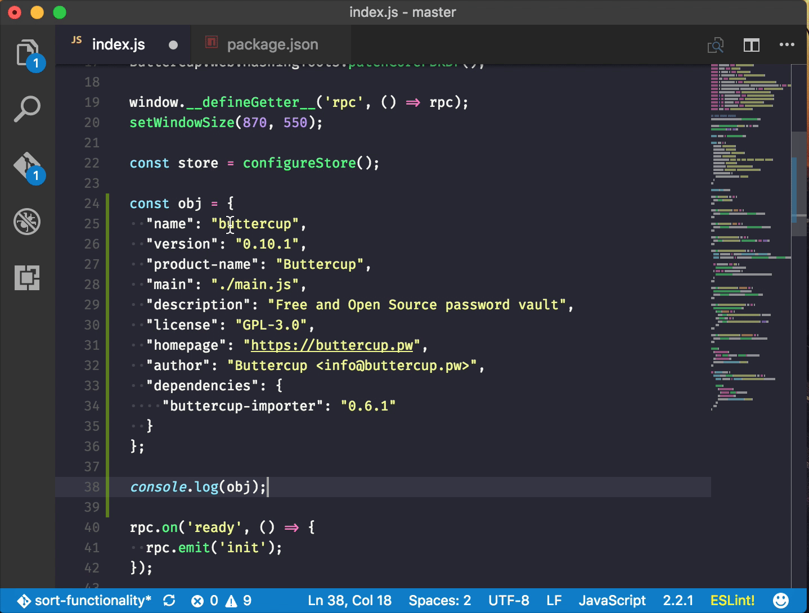

# VSCode Extension: JSON to JS Object

## Install

This extension is available for free in the [Visual Studio Code Marketplace](https://marketplace.visualstudio.com/items?itemName=sallar.json-to-js-object).

```
ext install json-to-js-object
```

## Features

+ Converts JSON Object to JavaScript Object
+ Converts `snake-case` keys to `camelCase` keys while converting the object

## How To Use



## Keyboard Shortcut

This extension does not define any keyboard shortcuts by default. However if you need one, you can use the `jsonToJSObject.convert` command to define your own shortcut.

## License

This extension is released under the [MIT License](LICENSE).
